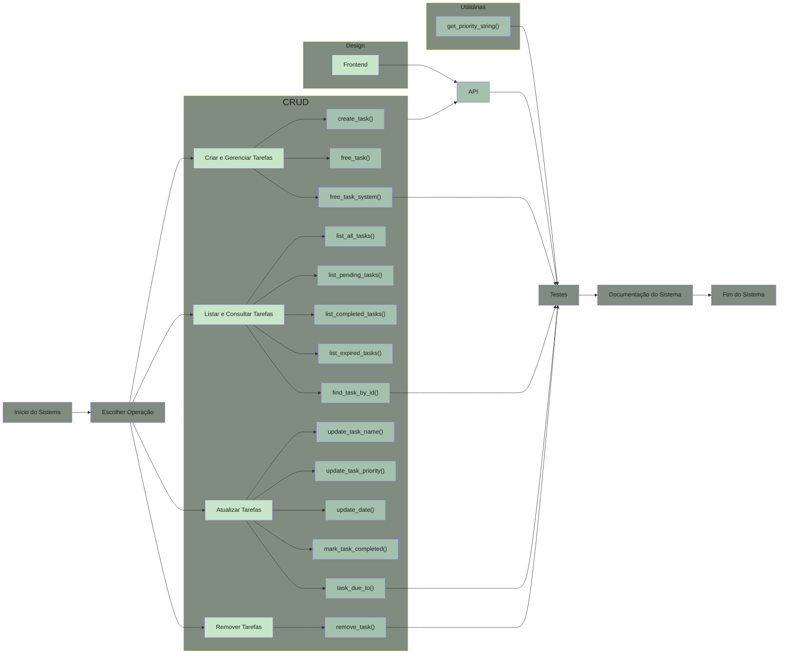

```mermaid
flowchart LR
 subgraph CRUD["<font size=5.5>CRUD</font>"]
        C1["create_task()"]
        C["Criar e Gerenciar Tarefas"]
        C2["free_task()"]
        C3["free_task_system()"]
        D1["list_all_tasks()"]
        D["Listar e Consultar Tarefas"]
        D2["list_pending_tasks()"]
        D3["list_completed_tasks()"]
        D4["list_expired_tasks()"]
        D5["find_task_by_id()"]
        E1["update_task_name()"]
        E["Atualizar Tarefas"]
        E2["update_task_priority()"]
        E3["update_date()"]
        E4["mark_task_completed()"]
        E5["task_due_to()"]
        F1["remove_task()"]
        F["Remover Tarefas"]
  end
 subgraph s1["Utilitárias"]
        U1["get_priority_string()"]
  end
 subgraph s2["Design"]
        G["Frontend"]
  end
    A["Início do Sistema"] --> B["Escolher Operação"]
    B --> C & D & E & F
    C --> C1 & C2 & C3
    D --> D1 & D2 & D3 & D4 & D5
    E --> E1 & E2 & E3 & E4 & E5
    F --> F1
    G --> H["API"]
    CRUD --> H
    H --> T1
    C3 --> T1["Testes"]
    F1 --> T1
    D5 --> T1
    E5 --> T1
    U1 --> T1
    T1 --> T2["Documentação do Sistema"]
    T2 --> Z["Fim do Sistema"]

    style C1 fill:#a3c1ad,color:#1f1f1f
    style C fill:#C8E6C9,color:#1f1f1f
    style C2 fill:#a3c1ad,color:#1f1f1f
    style C3 fill:#a3c1ad,color:#1f1f1f
    style D1 fill:#a3c1ad,color:#1f1f1f
    style D fill:#C8E6C9,color:#1f1f1f
    style D2 fill:#a3c1ad,color:#1f1f1f
    style D3 fill:#a3c1ad,color:#1f1f1f
    style D4 fill:#a3c1ad,color:#1f1f1f
    style D5 fill:#a3c1ad,color:#1f1f1f
    style E1 fill:#a3c1ad,color:#1f1f1f
    style E fill:#C8E6C9,color:#1f1f1f
    style E2 fill:#a3c1ad,color:#1f1f1f
    style E3 fill:#a3c1ad,color:#1f1f1f
    style E4 fill:#a3c1ad,color:#1f1f1f
    style E5 fill:#a3c1ad,color:#1f1f1f
    style F1 fill:#a3c1ad,color:#1f1f1f
    style F fill:#C8E6C9,color:#1f1f1f
    style U1 fill:#a3c1ad,color:#1f1f1f
    style G fill:#C8E6C9,color:#1f1f1f
    style H fill:#a3c1ad,color:#1f1f1f
    style A fill:#7f8c7f,color:#1f1f1f
    style B fill:#7f8c7f,color:#1f1f1f
    style CRUD fill:#7f8c7f,color:#1f1f1f
    style T1 fill:#7f8c7f,color:#1f1f1f
    style T2 fill:#7f8c7f,color:#1f1f1f
    style Z fill:#7f8c7f,color:#1f1f1f
    style s2 fill:#7f8c7f,color:#1f1f1f
    style s1 fill:#7f8c7f,color:#1f1f1f
```
